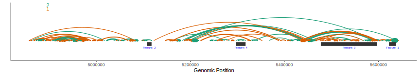
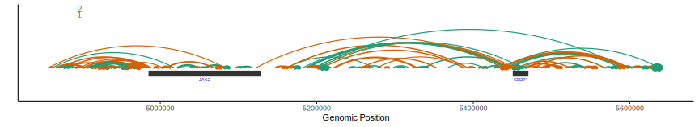
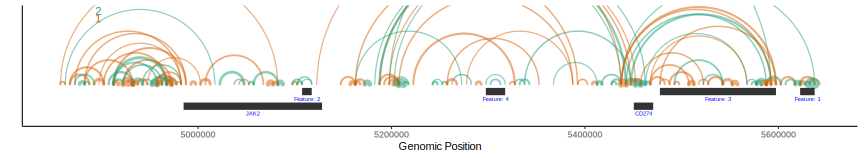
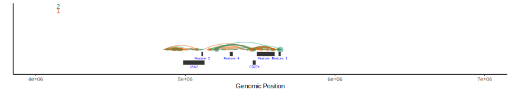
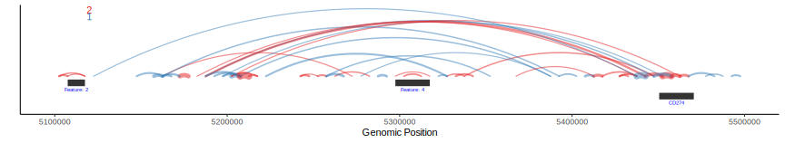

MintChip
=======

A tool for visualizing genomic interactions.


Installation
------------

1. Install R-3.5 or higher

2. Install devtools

```{r}
install.packages('devtools')
```
3. Install MintChip and dependent packages

```{r}
devtools::install_github('ZoranZG/MintChip')
```

MintChip parameters 
------------------

The main utility in MintChip comes from the `mintchip` function which visualizes 
genomic interactions from experiments such as HiChip. MintChip is designed for visualizing interactions on single chromosomes. The mintchip function takes several arguments:

#### interactions: 
a data.frame or data.table that contains start (default column name - 'start)' and end (default column name = 'end') coordinates of genomic interactions as well as any annotations you want to color by (default column name - 'annotation') and a numeric column that will map to interaction thickness (default column name - "thickness")

#### features:
a data.frame or data.table that contains the start (default column name - 'start') and end (default column name = 'end') coordinates of genomic features that you would like to plot as well as the color you would like these elements to be (default column name - 'color') and any text annotations that you would like to add to the features (default column name - 'name')

#### gene_list:
a character vector of gene names that you would like to plot, can pick between hg19 and hg38 using the `genome_build` parameter.

#### genome_build:
either "hg19" or "hg38" and indicates which genome build to pull the gene annotations from.

#### alpha:
a numeric value between 0 and 1 that specifies the transparency of the genomic interactions. alpha scales linearly with the number of overlaps, e.g. if alpha = 0.5 and two interactions intersect, their intersection will have the same transparency as one interaction at alpha = 1. alpha = 1 is no transparency. alpha = 0 is fully transparency.

#### height_scale:
a numeric (0,Inf) that sets the amount by which the higher peaks will stand out from lower peaks a high height_scale (e.g. 5) will yield highs that are much higher than the lows a low height_scale (e.g. 0.1) will yield a plot where most of the peaks are similar sizes.

#### thickness_scale:
a numeric (0,Inf) that sets the amount by which the thicker peaks will stand out from thinner peaks. A high thickness_scale (e.g. 5) will yield thick lines that are much thicker than the thinner lines. A low thickness_scale (e.g. 0.1) will yield a plot where most of the lines are similar thickness.

#### base_thickness:
linearly scales all line widths, e.g. if set to 2, all lines will be twice as thick, if set to 0.5, all lines will be half as thick.

#### xmin:
a numeric that indicates the leftmost genomic coordinate for plotting viewing. If not specified, automatically generated from the interactions, features, and gene_list.

#### xmax:
a numeric that indicates the rightmost genomic coordinate for plotting viewing. If not specified, automatically generated from the interactions, features, and gene_list.

#### color_pallete:
The RColorBrewer palette to use for annotating the genomic interactions, default is "Dark2"


Running MintChip
------------------

Basic interaction visualization
```{r}
mintchip(interactions = MintChip::frags_demo)\
```


Visualizing interactions and user defined features
```{r}
mintchip(interactions = MintChip::frags_demo,
         features = MintChip::features_demo)
         
```


Visualizing interactions and genes
note:
genome_build = "hg19" uses hg19 coordinates
genome_build = "hg38" uses hg38 coordinates
```{r}
mintchip(interactions = MintChip::frags_demo,
         gene_list = c('CD274', 'JAK2'))   
```




Visualizing interactions, feature and genes
```{r}
mintchip(interactions = MintChip::frags_demo,
         features = MintChip::features_demo,
         gene_list = c('CD274', 'JAK2'))
```


Adding in an alpha channel
```{r}
mintchip(interactions = MintChip::frags_demo,
         features = MintChip::features_demo,
         gene_list = c('CD274', 'JAK2'),
         alpha = 0.5)   
```


Changing peak height
height_scale of 1 makes height proportional to distance
```{r}
mintchip(interactions = MintChip::frags_demo,
         features = MintChip::features_demo,
         gene_list = c('CD274', 'JAK2'),
         alpha = 0.5,
         height_scale = 1) 
```


height_scale >1 makes height exponential to distance (e.g. distance^height_scale)
```{r}
mintchip(interactions = MintChip::frags_demo,
         features = MintChip::features_demo,
         gene_list = c('CD274', 'JAK2'),
         alpha = 0.5,
         height_scale = 4) 
```


height_scale < 1 makes heights more similar (e.g. distance^0 = 1 for uniform heights)
```{r}
mintchip(interactions = MintChip::frags_demo,
         features = MintChip::features_demo,
         gene_list = c('CD274', 'JAK2'),
         alpha = 0.5,
         height_scale = 0)   

```



Changing thickness
Thickness is defined by the 'thickness' column in the interactions data
base_thickness >1 increases size of all interactions uniformly
Basic interaction visualization
```{r}
mintchip(interactions = MintChip::frags_demo,
         features = MintChip::features_demo,
         gene_list = c('CD274', 'JAK2'),
         alpha = 0.5,
         height_scale = 1,
         base_thickness = 5)
```


base_thickness <1 decreases size of all interactions uniformly
```{r}
mintchip(interactions = MintChip::frags_demo,
         features = MintChip::features_demo,
         gene_list = c('CD274', 'JAK2'),
         alpha = 0.5,
         height_scale = 1,
         base_thickness = 0.2)
```


thickness_scale is similar to height scale except it works on thickness
e.g. thickness_scale > 1 increases thickness exponentially (e.g. thickness^2)
```{r}
mintchip(interactions = MintChip::frags_demo,
         features = MintChip::features_demo,
         gene_list = c('CD274', 'JAK2'),
         alpha = 0.5,
         height_scale = 1,
         base_thickness = 1,
         thickness_scale = 2)
```


e.g. thickness_scale < 1 decreases thickness exponentially 
and makes thickness more uniform (e.g. thickness^0 = 1)
```{r}
mintchip(interactions = MintChip::frags_demo,
         features = MintChip::features_demo,
         gene_list = c('CD274', 'JAK2'),
         alpha = 0.5,
         height_scale = 1,
         base_thickness = 1,
         thickness_scale = 0)
```


xmin and xmax can be used to change the plot view
zooming out
```{r}
mintchip(interactions = MintChip::frags_demo,
         features = MintChip::features_demo,
         gene_list = c('CD274', 'JAK2'),
         alpha = 0.5,
         height_scale = 1,
         base_thickness = 1,
         thickness_scale = 1,
         xmin = 4000000,
         xmax = 7000000)
```


zooming in
```{r}
mintchip(interactions = MintChip::frags_demo,
         features = MintChip::features_demo,
         gene_list = c('CD274', 'JAK2'),
         alpha = 0.5,
         height_scale = 1,
         base_thickness = 1,
         thickness_scale = 1,
         xmin = 5100000,
         xmax = 5500000)
```


You can also change the color palette
```{r}
mintchip(interactions = MintChip::frags_demo,
         features = MintChip::features_demo,
         gene_list = c('CD274', 'JAK2'),
         alpha = 0.5,
         height_scale = 1,
         base_thickness = 1,
         thickness_scale = 1,
         xmin = 5100000,
         xmax = 5500000,
         color_palette = 'Set1')
```



